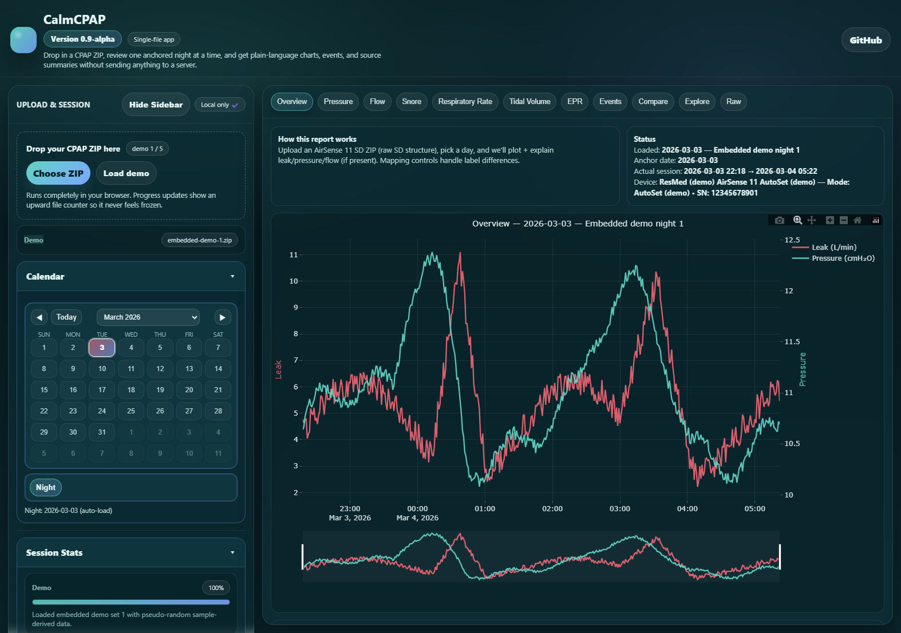
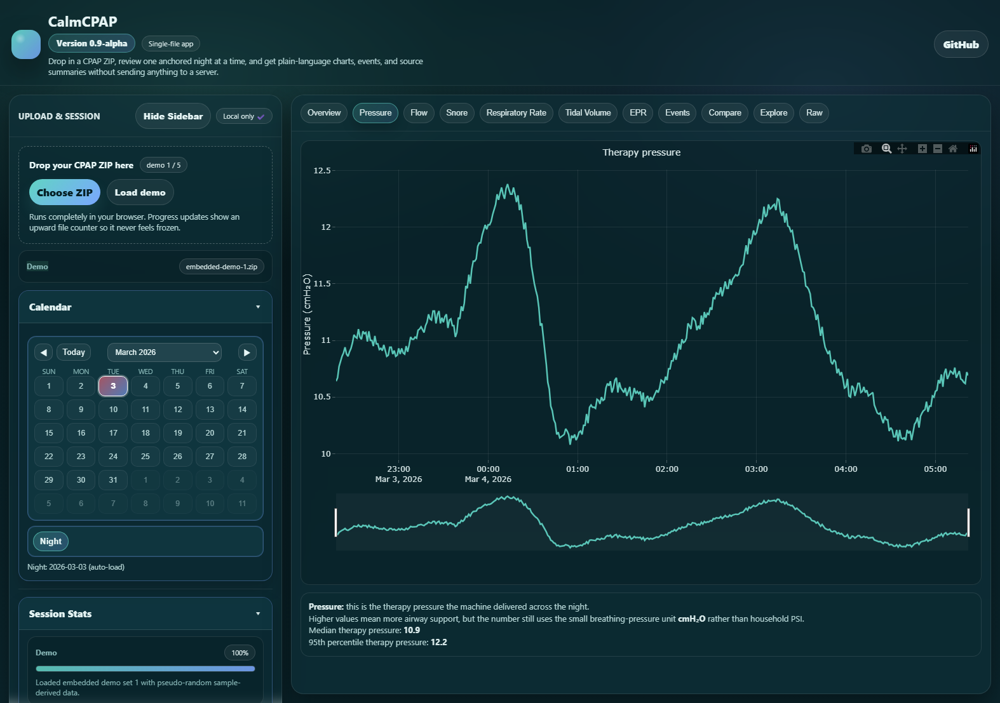
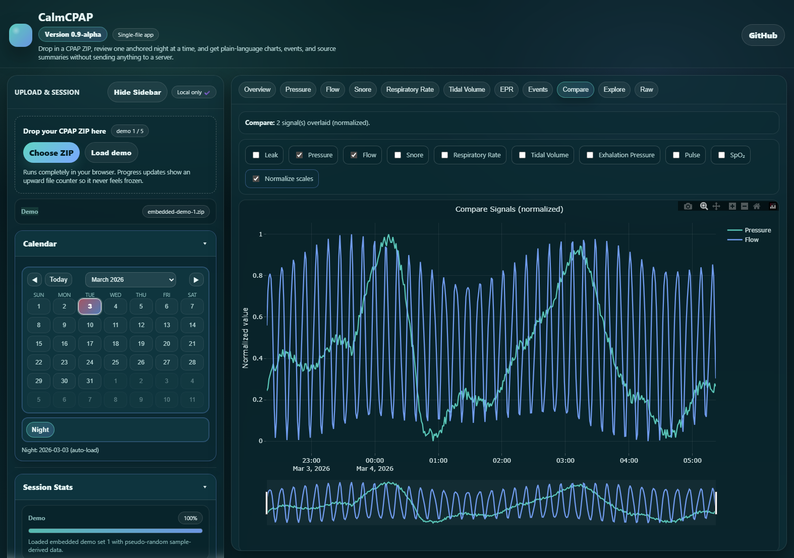
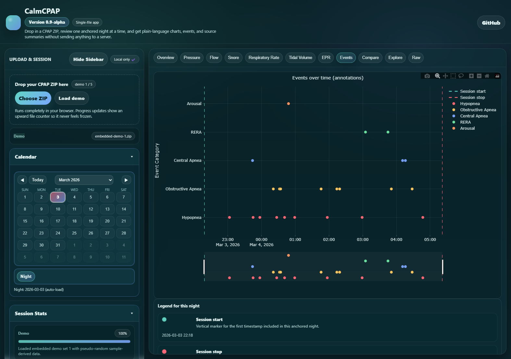

# CalmCPAP

CalmCPAP is a single-file browser app for opening CPAP SD-card ZIP exports, choosing one anchored night at a time, and getting plain-language charts without uploading your data anywhere.

<p align="center">
  
  
</p>
<p align="center">
  
  
</p>

The screenshots above come from the built-in demo mode. They are not real patient data.

## What CalmCPAP Does

- Opens CPAP ZIP exports directly in the browser.
- Keeps the app local-only. No backend, no account, no cloud upload step.
- Anchors the calendar to raw `DATALOG/YYYYMMDD` folder dates, then loads the full detected night for that anchor date.
- Shows charts for leak, therapy pressure, flow, snore, respiratory rate, tidal volume, exhalation pressure, events, and comparison overlays.
- Keeps a raw/debug snapshot in the lower-left sidebar so you can see which file families and signals were used.
- Ships as one self-contained runtime file: `index.html`.

## Real ZIP Uploads

CalmCPAP expects a ZIP made from the root of a CPAP SD card copy.

1. Power off the CPAP device and safely remove the SD card.
2. Copy the full card contents to your computer.
3. If you want a smaller test archive, trim older folders from `DATALOG/`.
4. ZIP that copied root folder.
5. Open `index.html` and load the ZIP.

The app reads the archive in your browser, inventories the source files it finds, and builds a nightly view from the EDF data already inside the ZIP.

## Demo Mode

The built-in demo is no longer a hand-written fake chart. CalmCPAP now embeds five transformed demo sessions generated from the provided sample archive.

- `Load demo` randomly picks one of the five embedded demo sessions.
- Refreshing in normal demo mode also rerolls among those five.
- All demo-facing identifiers and dates are shifted before display, while session windows still follow real sample timing.
- Demo chart values remain transformed rather than exposing the original sample values directly.
- The demo serial uses a same-length fake sequence instead of the real sample serial.

For documentation and screenshots, the app also supports a pinned demo-set override in the URL hash:

```text
#demo=1&demoSet=1&skipOnboarding=1&tab=overview
```

That override keeps a chosen demo set stable so screenshots can be regenerated consistently.

## Tabs in Plain English

- `Overview`: quick read on the selected anchored night, especially leak vs pressure.
- `Leak`: mask-seal behavior and time near the large-leak rule-of-thumb line.
- `Pressure`: therapy pressure over the full detected session.
- `Flow`: breathing waveform and shape changes.
- `Snore`: snore-related vibration trend.
- `Respiratory Rate`: breaths per minute over time.
- `Tidal Volume`: air moved per breath.
- `EPR`: therapy pressure vs exhalation pressure, plus derived relief from the pressure difference.
- `Events`: parsed annotations, session start/stop markers, a compact on-chart legend, and a collapsed glossary for known event types.
- `Compare`: overlay several signals on one plot.

For source inventory, mappings, headers, and debug output, use the `Raw / Debug Snapshot` drawer at the bottom of the left sidebar.

## EPR Interpretation

CalmCPAP treats `EprPress.2s` as absolute exhalation pressure, not as the `0-3` comfort setting itself.

That means values like `4-7 cmH2O` can be valid. They are still real pressure values during exhale. The relief amount is derived from the difference between therapy pressure and exhalation pressure. `CurrentSettings.json` is used only as a settings cross-check.

## Privacy and Scope

- CalmCPAP runs locally in your browser.
- It is meant for exploration, education, and for-fun inspection of export data.
- It is not medical advice.
- It is not a diagnosis tool.
- It should not be used for treatment decisions or emergencies.

## Screenshot Refresh

The screenshot script pins demo set `1` so the README gallery stays reproducible even though normal demo mode is random:

```powershell
powershell -ExecutionPolicy Bypass -File scripts\capture-marketing-screenshots.ps1
```

That command refreshes the four README screenshots in `assets/`.
