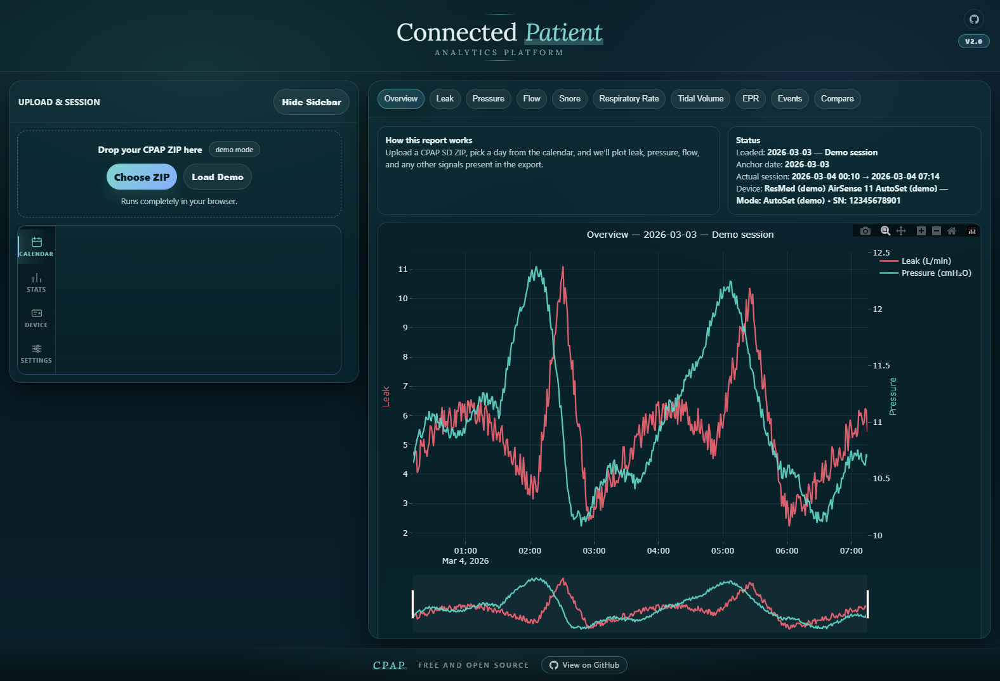
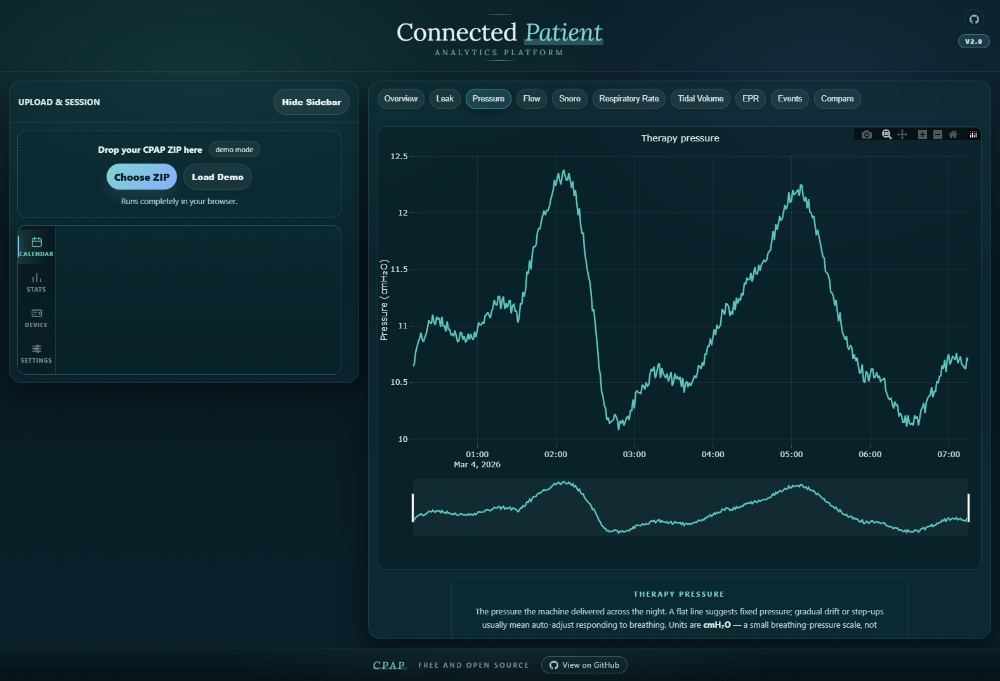
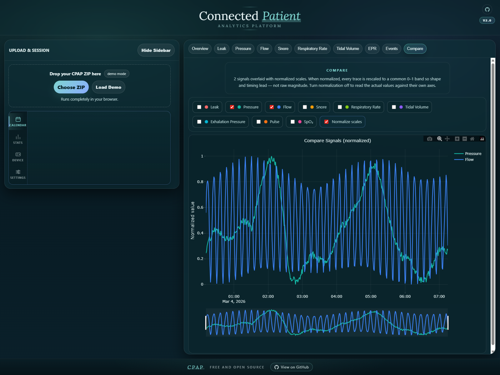
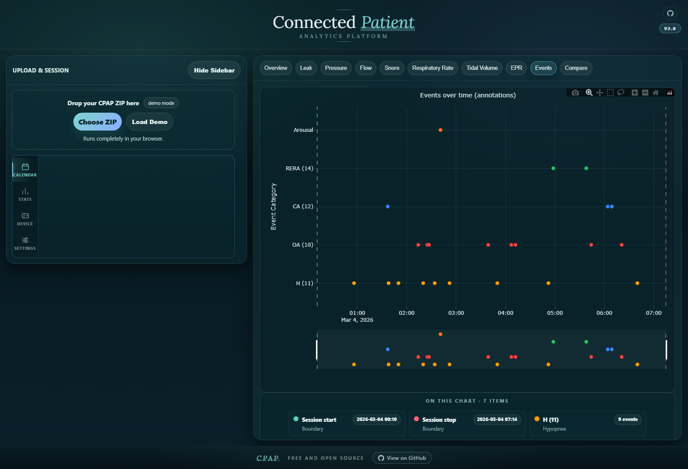

# Connected Patient Analytics Platform

A single-file, local-only browser application for parsing CPAP SD-card exports and rendering each night as interactive charts. No backend, no account, no network upload of patient data.

**Version 2.0** · Tested only on ResMed AirSense 11. Other devices may load partially or not at all.

<p align="center">
  
  
</p>
<p align="center">
  
  
</p>

Screenshots come from the built-in demo mode. They are not real patient data.

A marketing-oriented landing page for the project lives in `index.html` and is intended for GitHub Pages. The README is the technical reference.

## What it does

- Opens a CPAP SD-card ZIP directly in the browser — the ZIP is read with JSZip, in memory, and nothing is sent over the network.
- Parses EDF / EDF+ headers, samples, and annotation signals out of the archive.
- Anchors the calendar on raw `DATALOG/YYYYMMDD` folder dates, then extends the view across the full detected session window around that anchor.
- Plots leak, therapy pressure, flow, snore, respiratory rate, tidal volume, exhalation pressure, events, and arbitrary signal overlays.
- Ships as one self-contained file: `CPAP.html` (~5.5k lines, ~210 KB).

## Repository layout

```
CPAP.html                             # the application — self-contained HTML + JS + CSS
index.html                            # GitHub Pages landing page
assets/                               # screenshots, favicons, mask-badge icons
  cpap-overview.png
  cpap-pressure.png
  cpap-compare.png
  cpap-events.png
scripts/
  capture-marketing-screenshots.ps1   # headless Edge/Chrome screenshot refresh
```

## How it works

### Input: SD-card archive

The app expects a ZIP produced from the root of a CPAP SD card. The archive is inventoried for:

| Path / family            | Purpose                                                           |
| ------------------------ | ----------------------------------------------------------------- |
| `Identification.tgt`     | Device metadata (serial, model)                                   |
| `CurrentSettings.json`   | Current therapy settings — cross-check for derived EPR values     |
| `STR.edf`                | Summary EDF (attached to the most recent anchor date)             |
| `DATALOG/YYYYMMDD/*.edf` | Per-session EDFs, grouped by family prefix: `PLD`, `BRP`, `EVE`, `CSL`, `SA2` |

`PLD_*.edf` holds the slow (~2 s) sampled signals (leak, mask pressure, EPR pressure, snore, respiratory rate, tidal volume). `BRP_*.edf` holds the fast flow waveform. `EVE_*.edf` holds the EDF+ annotation signal. `CSL` and `SA2` are inventoried but used as source-inventory markers only.

### Parsing pipeline

1. `JSZip.loadAsync(buffer)` reads the archive entirely client-side.
2. The archive is walked once to classify entries and find `DATALOG/YYYYMMDD/` day folders.
3. For each relevant EDF, the header is decoded (record count, record duration, signal count, per-signal label / units / digital & physical min-max) to derive the record byte layout.
4. Signal samples are decoded into `Float64Array`s scaled by each signal's calibration, and tagged with an absolute start time from the EDF header (`dd.mm.yy hh.mm.ss`).
5. EDF+ annotation records (the `EDF Annotations` signal) are parsed into typed events (onset, duration, code) and deduplicated per event code.
6. Signals are cataloged and exposed through the sidebar's catalog view; the render layer pulls canonical keys (`leak`, `pressure`, `flow`, `snore`, `resprate`, `tidal`, `epr`) out of the catalog by label matching.

### Session detection

The calendar tracks the raw `DATALOG/YYYYMMDD` folder dates. Picking an anchor date loads every EDF attached to that folder plus any EDFs whose own start/end timestamp overlaps the anchor's session window, so a single report stretches across the full night even when it crosses midnight. Session boundaries derived from the EDFs are drawn as vertical markers on all per-signal plots.

### Event annotations

Events come straight out of the EDF+ annotation channel. Each annotation is decoded, tagged with the source file, and assigned a category by code (`OA`, `H`, `CA`, `RERA`, `FL`, `CSR`, etc.). The Events tab groups them by code, draws dots along the session timeline with session-boundary rails, and renders a glossary underneath so each tag is explained in plain language.

### EPR interpretation

This app treats `EprPress.2s` as **absolute exhalation pressure**, not as the 0–3 comfort setting itself. That means values in the `4–7 cmH₂O` range are valid — they are real pressure readings measured during exhale. The relief amount reported on the EPR tab is derived from the difference between therapy pressure and exhalation pressure at matching timestamps. `CurrentSettings.json` is consulted only as a sanity cross-check.

## Tabs

Every tab runs against the same session payload, each computing its own summary narrative from the samples in that window.

- **Overview** — leak and pressure co-plotted for the session, with usage hours, 95th-percentile leak, median pressure, and event counts.
- **Leak** — mask-seal behavior with the large-leak guide line drawn in.
- **Pressure** — therapy pressure at full per-sample resolution from `MaskPress.2s`.
- **Flow** — breathing waveform from `BRP` (the highest-rate channel in the archive).
- **Snore** — vibration-based snore channel.
- **Respiratory Rate** — breaths per minute across the session.
- **Tidal Volume** — air moved per breath with male/female baseline reference lines.
- **EPR** — therapy vs. exhalation pressure with derived relief.
- **Events** — parsed EDF+ annotations per code, with session markers and a glossary.
- **Compare** — overlay any subset of the signals above on one plot, normalized or raw.

The left-side icon rail switches between `Calendar`, `Session Stats`, `Device & Profile`, and `Current Settings` panels. Source inventory, signal catalog, EDF header dumps, and a debug log live in the Session Stats / Device panels.

## Running it

### Your own ZIP

1. Power off the CPAP device and safely remove the SD card.
2. Copy the full card contents into a folder on your computer, preserving the folder structure (`DATALOG/`, `STR.edf`, `Identification.tgt`, `SETTINGS/`).
3. Optional: trim older day folders from `DATALOG/` to shrink the archive.
4. Create one `.zip` from that folder (zip the folder *contents*, so `DATALOG/` is at the ZIP root).
5. Open `CPAP.html` in a modern browser and drop the ZIP on the upload area.

Tip: `CPAP.html` is self-contained — you can drop the file onto the SD card itself and travel with both together.

### Demo mode

The build embeds five transformed sessions generated from a sample archive. `Load demo` randomizes across the five; a full page refresh re-rolls. Identifiers, dates, and all signal values are shifted before display; the demo serial uses a same-length fake sequence.

### URL hash parameters

For reproducible screenshots and deep links, the app reads flags from the URL fragment on load:

| Key              | Example            | Effect                                                |
| ---------------- | ------------------ | ----------------------------------------------------- |
| `demo`           | `demo=1`           | Start in demo mode                                    |
| `demoSet`        | `demoSet=1`        | Pin a specific demo session (`1`–`5`), skip the roll  |
| `skipOnboarding` | `skipOnboarding=1` | Bypass the first-run onboarding card                  |
| `tab`            | `tab=pressure`     | Open directly to a tab (`overview`, `leak`, `pressure`, `flow`, `snore`, `resprate`, `tidal`, `epr`, `events`, `compare`) |

Combined example, usable directly from `file://`:

```text
CPAP.html#demo=1&demoSet=1&skipOnboarding=1&tab=overview
```

## Privacy and scope

- Runs locally in your browser. The ZIP is decoded in memory and nothing is uploaded.
- The app loads two third-party scripts from public CDNs at page open — `jszip@3.10.1` and `plotly-2.30.0` — so a first-time launch needs internet. Everything after that stays local. For fully offline use, vendor those two scripts next to `CPAP.html` and swap the `<script src="…">` tags to relative paths.
- Intended for exploration and curiosity. **Not a medical device. Not a clinical tool. Not medical advice.** Do not rely on it for treatment decisions — talk to your doctor or sleep specialist.

## Dependencies

| Dependency      | Version | Source                                              |
| --------------- | ------- | --------------------------------------------------- |
| JSZip           | 3.10.1  | `cdn.jsdelivr.net/npm/jszip`                        |
| Plotly.js       | 2.30.0  | `cdn.plot.ly`                                       |
| Google Fonts    | —       | `fonts.googleapis.com` (Lora + Inter)               |

No build tooling, bundler, package manager, or framework. The file is hand-authored HTML + vanilla JS + CSS.

## Screenshot refresh

The capture script pins demo set `1` so the gallery stays reproducible:

```powershell
powershell -ExecutionPolicy Bypass -File scripts\capture-marketing-screenshots.ps1
```

It drives headless Edge (falls back to Chrome) at 1600×1200, loads each tab via the URL-hash flags above, saves a PNG, and trims the white border via `System.Drawing`. The four `cpap-*.png` files in `assets/` are overwritten in place.
